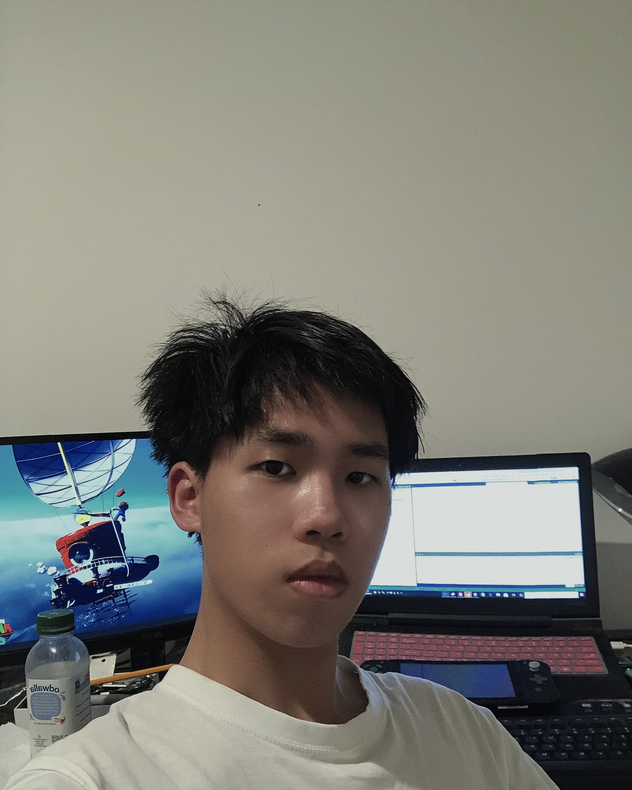

<a>
  
</a>

<a href="https://github.com/SoulCoder3">
  
</a>

# About me
#### As a person
&emsp; Hello, my name is **Jiawei Huang**. My friends also call me David. I was born in a small town called [Taishan](/picture/Taishan.png) in Guangdong, China. I came to the United States in 2018 and received an American education. I am currently a junior at **University of California, San Diego(UCSD)**, majoring in Computer Science.
> The University of California, San Diego is a public land-grant research university in San Diego, California, United States.

#### As a programmer
&emsp; My passion for technology led me to pursue a computer science degree at UCSD, where I could delve more deeply into the intricacies of software development and programming. Programming is a method that allows me to create new things. Regarding the programming languages ​​that I have come into contact with so far, if I were to rank these languages, I would have
```java
1. Java
2. Python
3. C++
4. C
5. C#
```
I participated in the project development of the _ACM Association_ in UCSD, where I learned to use ***MERN*** stack to develop web projects. I was mainly responsible for backend development, using Express.js, Node.js and MongoDB. 
I am currently looking for more opportunities to participate in projects to gain experience.

#### Career Goal
* Earn a bachelor's degree in computing from UCSD
* Pursuing a career as a software engineer

#### Next Step
- [x] Preliminary completed resume template
- [x] Algorithm learning and leetcode question practice
- [ ] Enrich project experiences
- [ ] Complete resume
- [ ] Seek out internships and work opportunities


